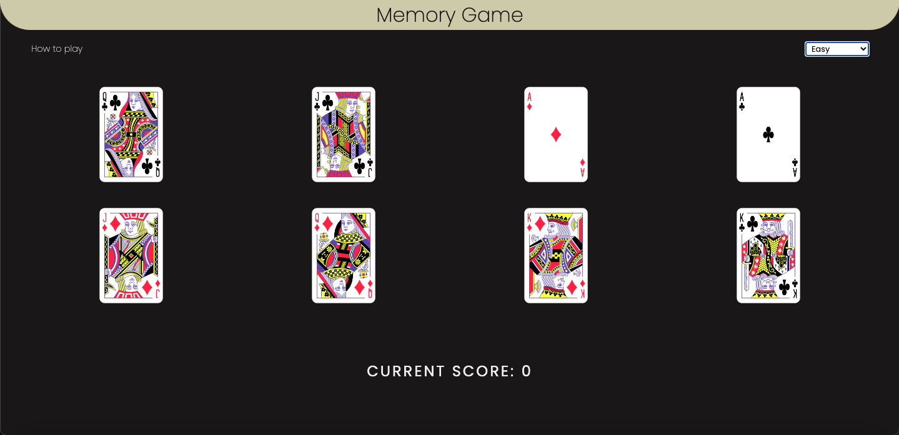

# `React` memory_game app


## [Demo](https://bbm2910.github.io/memory-game/)

## How to play
- The goal is to score points by clicking on different cards.
- On each turn, a player can click on any card to reshuffle all cards.
- If the player clicks on a different card each time, they score a point
- If the player clicks on the same card, the score resets to zero.
- The player wins when they have guessed all the cards.

## Installing and running
  ```
   git clone https://github.com/bbm2910/memory-game.git
   cd memory-game
   npm install
   npm run dev
```
